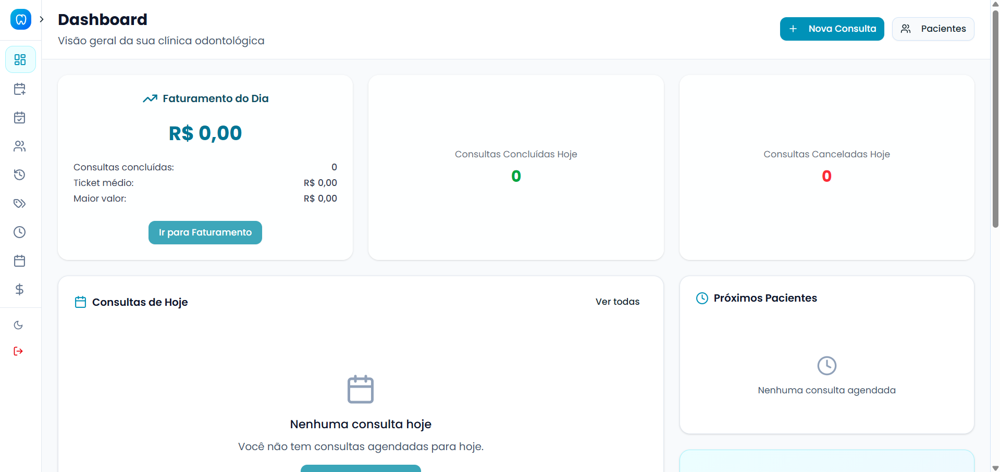
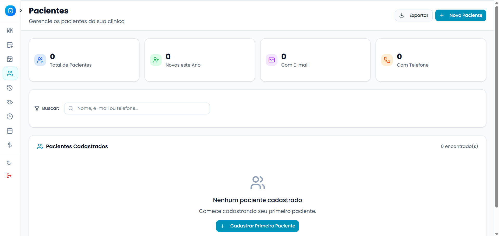
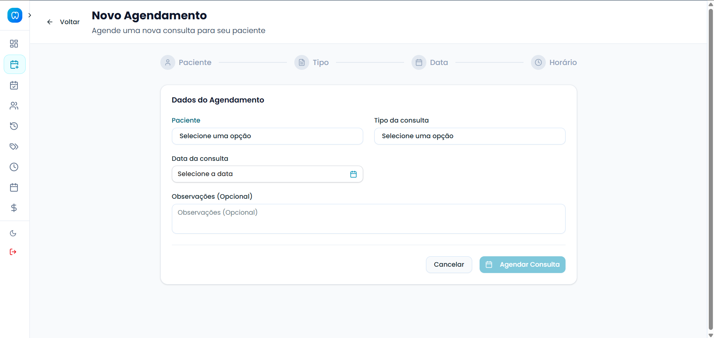
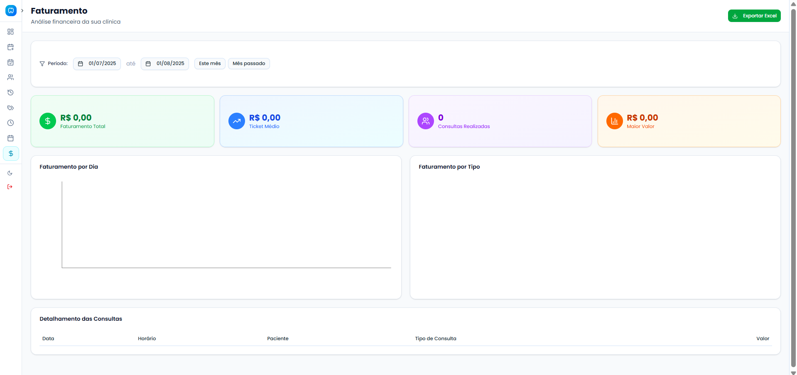

# 🦷 **OdontoSystem** - Sistema de Gestão Odontológica

<div align="center">


**Sistema completo para gestão de clínicas odontológicas com interface moderna e intuitiva**

[🚀 Demo](#-demo) • [📋 Funcionalidades](#-funcionalidades) • [🛠️ Instalação](#️-instalação) • [📱 Screenshots](#-screenshots)

</div>

---

## 🎯 **Sobre o Projeto**

O **OdontoSystem** é uma solução completa para gestão de clínicas odontológicas, desenvolvida com as mais modernas tecnologias web. O sistema oferece uma interface intuitiva e responsiva para gerenciar pacientes, consultas, agendamentos, faturamento e muito mais.

### ✨ **Principais Diferenciais:**
- 🎨 **Interface Moderna**: Design clean com tema claro/escuro
- 📱 **Totalmente Responsivo**: Funciona perfeitamente em desktop, tablet e mobile
- ⚡ **Performance Otimizada**: Carregamento rápido e navegação fluida
- 🔒 **Seguro**: Autenticação robusta e proteção de dados
- 📊 **Relatórios Completos**: Dashboards e exportação para Excel
- 🌙 **Tema Escuro/Claro**: Alternância automática ou manual

---

## 🚀 **Demo**

### 🌐 **Acesso Online**
```
🔗 URL: [Em breve]
👤 Usuário: demo@odonto.com
🔑 Senha: demo123
```

### 💻 **Executar Localmente**
```bash
# Clone o repositório
git clone https://github.com/seu-usuario/odonto-system.git

# Instale as dependências
npm install

# Execute o projeto
npm run dev

# Acesse: http://localhost:5173
```

---

## 📋 **Funcionalidades**

### 👥 **Gestão de Pacientes**
- ✅ Cadastro completo com dados pessoais
- ✅ Histórico médico e observações
- ✅ Busca avançada e filtros
- ✅ Exportação para Excel
- ✅ Edição e exclusão de registros

### 📅 **Sistema de Agendamento**
- ✅ Calendário interativo
- ✅ Agendamento por horários disponíveis
- ✅ Reagendamento e cancelamento
- ✅ Notificações automáticas
- ✅ Controle de conflitos

### 🏥 **Consultas**
- ✅ Registro de consultas realizadas
- ✅ Status: Agendada, Concluída, Cancelada
- ✅ Observações e anotações
- ✅ Histórico completo por paciente
- ✅ Relatórios detalhados

### 💰 **Faturamento**
- ✅ Controle financeiro completo
- ✅ Valores por tipo de consulta
- ✅ Relatórios de receita
- ✅ Gráficos e estatísticas
- ✅ Exportação para Excel com horários

### 📊 **Dashboard Analítico**
- ✅ Métricas em tempo real
- ✅ Gráficos interativos
- ✅ Indicadores de performance
- ✅ Resumo financeiro
- ✅ Próximas consultas

### ⚙️ **Configurações**
- ✅ Tipos de consulta personalizáveis
- ✅ Escalas de trabalho
- ✅ Liberação de agenda
- ✅ Configurações de usuário
- ✅ Backup e restauração

---

## 🛠️ **Tecnologias Utilizadas**

### **Frontend**
```json
{
  "framework": "React 19.1.0",
  "linguagem": "TypeScript",
  "bundler": "Vite",
  "styling": "TailwindCSS 4.1.11",
  "ui": "Radix UI + Shadcn/ui",
  "icons": "Lucide React",
  "routing": "React Router DOM 7.6.3",
  "forms": "React Hook Form + Zod",
  "charts": "Recharts 3.1.0",
  "dates": "date-fns 4.1.0",
  "notifications": "React Toastify",
  "exports": "XLSX + File-saver"
}
```

### **Ferramentas de Desenvolvimento**
```json
{
  "linting": "ESLint 9.30.1",
  "types": "TypeScript 5.0+",
  "build": "Vite + TypeScript",
  "package_manager": "NPM"
}
```

---

## 🏗️ **Arquitetura do Projeto**

```
src/
├── 📁 components/          # Componentes reutilizáveis
│   ├── 📁 ui/             # Componentes base (Shadcn/ui)
│   └── 📁 common/         # Componentes específicos
├── 📁 pages/              # Páginas da aplicação
│   ├── 📄 Dashboard.tsx   # Painel principal
│   ├── 📄 Pacientes.tsx   # Gestão de pacientes
│   ├── 📄 Agendamento.tsx # Sistema de agendas
│   ├── 📄 Consultas.tsx   # Consultas agendadas
│   ├── 📄 Historico.tsx   # Histórico de consultas
│   └── 📄 Faturamento.tsx # Controle financeiro
├── 📁 services/           # Integração com APIs
├── 📁 types/              # Definições TypeScript
├── 📁 utils/              # Utilitários e helpers
├── 📁 hooks/              # Custom hooks
├── 📁 context/            # Context API
└── 📁 constants/          # Constantes da aplicação
```

---

## ⚡ **Instalação e Configuração**

### **Pré-requisitos**
```bash
Node.js >= 18.0.0
NPM >= 9.0.0
```

### **Passo a Passo**

#### 1️⃣ **Clone o Repositório**
```bash
git clone https://github.com/seu-usuario/odonto-system.git
cd odonto-system
```

#### 2️⃣ **Instale as Dependências**
```bash
npm install
```

#### 3️⃣ **Configure as Variáveis de Ambiente**
```bash
# Crie o arquivo .env.local
cp .env.example .env.local

# Configure as variáveis
VITE_API_URL=http://localhost:3000/api
VITE_APP_NAME=OdontoSystem
```

#### 4️⃣ **Execute o Projeto**
```bash
# Desenvolvimento
npm run dev

# Build para produção
npm run build

# Preview da build
npm run preview
```

#### 5️⃣ **Acesse a Aplicação**
```
🌐 Desenvolvimento: http://localhost:5173
📦 Preview: http://localhost:4173
```

---

## 📱 **Screenshots**

### 🏠 **Dashboard Principal**
<div align="center">

<p><em>Painel principal com métricas e gráficos em tempo real</em></p>
</div>

### 👥 **Gestão de Pacientes**
<div align="center">

<p><em>Interface completa para gerenciamento de pacientes</em></p>
</div>

### 📅 **Sistema de Agendamento**
<div align="center">

<p><em>Calendário interativo para agendamento de consultas</em></p>
</div>

### 💰 **Relatório de Faturamento**
<div align="center">

<p><em>Controle financeiro com gráficos e exportação</em></p>
</div>

---

## 🎨 **Temas e Personalização**

### **Tema Claro/Escuro**
```typescript
// Alternância automática baseada no sistema
const { theme, setTheme } = useTheme()

// Temas disponíveis
'light' | 'dark' | 'system'
```

### **Cores Personalizáveis**
```css
/* Paleta principal */
--primary: 186 100% 37%;      /* Cyan-600 */
--secondary: 215 28% 17%;     /* Slate-800 */
--accent: 43 96% 56%;         /* Yellow-400 */
--destructive: 0 84% 60%;     /* Red-500 */
```

---

## 📊 **Funcionalidades de Exportação**

### **Excel Export** 📈
```typescript
// Todas as páginas com exportação funcional
✅ Faturamento → faturamento_DD-MM-YYYY_HH-mm.xlsx
✅ Histórico → historico_consultas_DD-MM-YYYY_HH-mm.xlsx  
✅ Consultas → consultas_agendadas_DD-MM-YYYY_HH-mm.xlsx
✅ Pacientes → pacientes_DD-MM-YYYY_HH-mm.xlsx
```

### **Dados Exportados**
- 📅 **Consultas**: Data, Horário, Paciente, Tipo, Status, Valores
- 👥 **Pacientes**: Nome, Contato, Data Nascimento, Cadastro
- 💰 **Faturamento**: Receitas, Valores, Períodos, Comparativos

---

## 🔧 **Scripts Disponíveis**

```bash
# Desenvolvimento
npm run dev          # Inicia servidor de desenvolvimento

# Build
npm run build        # Gera build de produção
npm run preview      # Preview da build

# Qualidade de Código
npm run lint         # Executa ESLint
npm run type-check   # Verifica tipos TypeScript

# Utilitários
npm run clean        # Limpa cache e node_modules
npm run analyze      # Analisa bundle size
```

---

## 🚀 **Deploy**

### **Vercel** (Recomendado)
```bash
# Instale a CLI da Vercel
npm i -g vercel

# Deploy
vercel --prod
```

### **Netlify**
```bash
# Build
npm run build

# Deploy pasta dist/
netlify deploy --prod --dir=dist
```

### **Docker**
```dockerfile
FROM node:18-alpine
WORKDIR /app
COPY package*.json ./
RUN npm ci --only=production
COPY . .
RUN npm run build
EXPOSE 3000
CMD ["npm", "run", "preview"]
```

---

## 🤝 **Contribuição**

### **Como Contribuir**
1. 🍴 Fork o projeto
2. 🌿 Crie uma branch: `git checkout -b feature/nova-funcionalidade`
3. 💾 Commit suas mudanças: `git commit -m 'Add: nova funcionalidade'`
4. 📤 Push para a branch: `git push origin feature/nova-funcionalidade`
5. 🔄 Abra um Pull Request

### **Padrões de Commit**
```
feat: nova funcionalidade
fix: correção de bug
docs: documentação
style: formatação
refactor: refatoração
test: testes
chore: manutenção
```

---

## 📝 **Licença**

Este projeto está sob a licença **MIT**. Veja o arquivo [LICENSE](LICENSE) para mais detalhes.

---

## 👨‍💻 **Autor**

<div align="center">

**Desenvolvido com ❤️ por [Seu Nome]**

[](https://linkedin.com/in/arthurgranito)
[](https://github.com/arthurgranito)
[](mailto:arthurgranitodev@gmail.com)

</div>

---

## 🙏 **Agradecimentos**

- 🎨 **Shadcn/ui** - Componentes UI incríveis
- 🎯 **Radix UI** - Primitivos acessíveis
- 🎨 **Tailwind CSS** - Framework CSS utilitário
- ⚡ **Vite** - Build tool super rápido
- 📊 **Recharts** - Gráficos para React

---

<div align="center">

### ⭐ **Se este projeto te ajudou, deixe uma estrela!**

**OdontoSystem** - *Transformando a gestão odontológica* 🦷✨

</div>